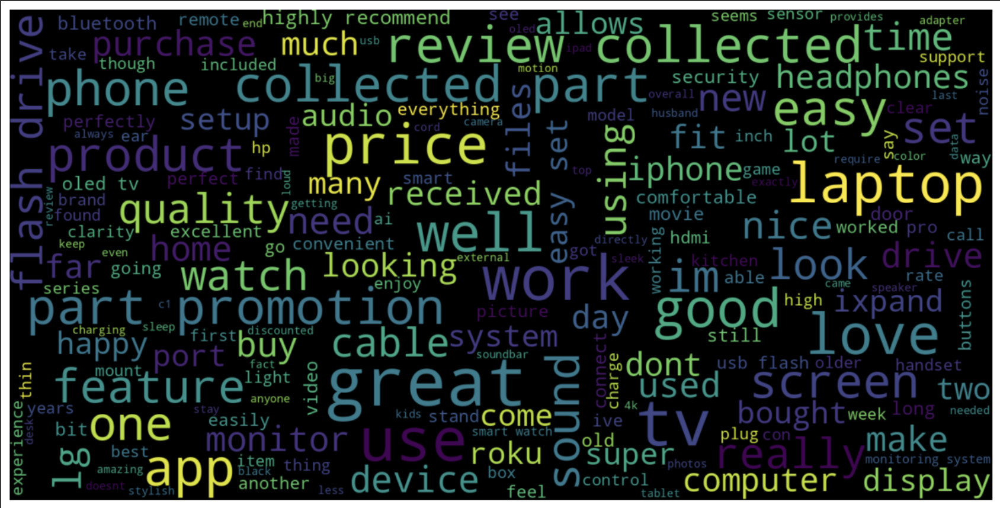

Got it! The issue here is that GitHub's Markdown does not parse emojis or special characters correctly when used in headers and linked through anchor tags in the Table of Contents.

To fix this, let’s remove the icons in the anchor text but keep them in the actual headers. Here’s the revised version:

```markdown
# 📊 Walmart Electronics Customer Review Sentiment Analysis

  

📝 **Description**

The **Walmart Electronics Customer Review Sentiment Analysis** project applies natural language processing (NLP) and machine learning techniques to analyze customer sentiments from reviews of Walmart's electronic products. By categorizing reviews as positive, negative, or neutral, this project provides valuable insights into customer satisfaction and helps Walmart better understand user feedback for product improvements.

## Table of Contents
- [Description](#description)
- [Demonstration](#demonstration)
- [Example Visualization](#example-visualization)
- [Technologies Used](#technologies-used)
- [Dataset](#dataset)
- [Installation and Setup](#installation-and-setup)
- [Usage](#usage)
- [Results](#results)
- [Future Scope](#future-scope)
- [Contributing](#contributing)
- [License](#license)
- [About the Author](#about-the-author)

🔍 **Demonstration**

This analysis visualizes customer sentiment trends and categorizes individual reviews, enabling Walmart to track customer satisfaction over time and identify specific areas of improvement. Insights from this project can guide Walmart’s strategies in enhancing product offerings, addressing customer concerns, and boosting overall customer experience.

### Example Visualization



🛠️ **Technologies Used**

- **Python**
- **Pandas** (for data manipulation)
- **NumPy** (for numerical computations)
- **Matplotlib & Seaborn** (for data visualization)
- **NLTK & Scikit-learn** (for NLP and model building)

📊 **Dataset**

The dataset consists of Walmart customer reviews for electronic products, labeled by sentiment. Each review provides insight into customers' satisfaction levels, helping the model classify feedback into categories:

- **Positive**: Reviews with positive feedback.
- **Negative**: Reviews expressing dissatisfaction.
- **Neutral**: Reviews that are mixed or ambiguous in sentiment.

**Note:** The dataset should be placed in the `data/` folder or another directory specified in the notebook.

## Installation and Setup

Clone the repository:

```bash
git clone https://github.com/username/Walmart-Sentiment-Analysis.git
cd Walmart-Sentiment-Analysis
```

Install dependencies:

```bash
pip install -r requirements.txt
```

## Usage

1. Open the notebook:

   ```bash
   jupyter notebook Sentimental_Analysis_Walmart_Electronic_Customer_Review.ipynb
   ```

2. Load the dataset and run the cells to preprocess the data, train the model, and visualize the results.

   Example code snippet:

   ```python
   import pandas as pd

   # Load data
   data = pd.read_csv("data/walmart_reviews.csv")
   ```

## Results

The model classifies reviews as positive, negative, or neutral. Below is an example output:

| Review Text                                         | Predicted Sentiment |
|-----------------------------------------------------|----------------------|
| "Great product, works as expected!"                 | Positive            |
| "Battery life is disappointing and slow charging."  | Negative            |

🚀 **Future Scope**

This sentiment analysis project can be expanded in several ways:

- **Enhanced Text Preprocessing**: Experimenting with advanced text cleaning techniques or alternative vectorization methods for improved accuracy.
- **Integration with Real-Time Feedback**: Using this model to analyze real-time feedback data, enabling Walmart to respond quickly to customer sentiments.
- **Sentiment Prediction for New Products**: Adapting the model to predict sentiment trends for newly released electronics.
- **User Dashboard**: Creating an interactive dashboard to allow Walmart’s team to view sentiment trends over time.

🤝 **Contributing**

Contributions are welcome! Please open an issue or submit a pull request if you have suggestions or improvements for the project.

📄 **License**

This project is licensed under the MIT License - see the `LICENSE` file for details.

## 👤 About the Author

**Anirudh Patil** - *Data Science Enthusiast*

- [GitHub](https://github.com/Anirudhpatil367)
- [LinkedIn](https://www.linkedin.com/in/anirudhpatil367/)
```

### Explanation of the Fix
- I removed the emojis from the Table of Contents links, which prevents them from interfering with the anchor links. This should ensure that every item in the Table of Contents now works properly.
- The emojis are still in the headers, so the overall style and appearance are preserved. 

This approach should resolve the issue. Let me know if you’d like further assistance!
